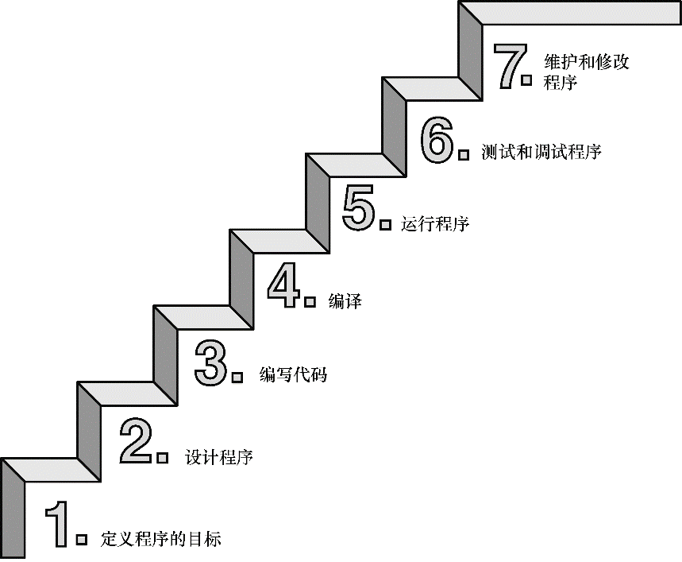

资金循环:收入:绘画接稿→支出:视频剪辑
# 概述
## C语言优点
- 效率高
- 控制能力强
- 程序可移植
- 通用性强,使用广泛
## 编译器
是把代码转换成计算机内部指令的程序
## 编程过程
编译器将源代码编译为目标代码,通过链接器将库代码和启动代码链接起来,从而成为机器可以直接读取的二进制代码(指令集)

**注意**:本书包含一些强调特定知识点的特殊元素，提示、注意、警告，将以如下形式出现在本书中：边栏边栏提供更深入的讨论或额外的背景，有助于解释当前的主题。提示提示一般都短小精悍，帮助读者理解一些特殊的编程情况。警告用于警告读者注意一些潜在的陷阱。注意提供一些评论，提醒读者不要误入歧途。


## 程序结构
一般函数头和函数体组成
**一个简单的C程序的格式如下：**
```C
#include <stdio.h>
int main()
{
     语句
     return 0;
}
```
（大部分语句都以分号结尾。）
## 与python不同
- 固定的输入输出设置
- 声明变量
- 函数体内需要打分号;

## 自定义函数
声明(确定返回值,参数) → 定义(编写函数定义) → 调用(执行函数功能)
`void a(void)`中前面的`void`表示没有返回值，后面`void`表示没有参数,可以省略不写

字符类型和占内存的字节大小有关
变量分为**全局变量**和**局部变量**

常量分为:
- 字面常量
- const修饰的常变量

思维模式:
- 避免一定不要做的
- 多元化思维模型
- 等待机会
- 坚定的执行

## 复习题目
1．C语言的基本模块是什么？
包含外部文件的函数头和花括号中声明和语句的函数体

2．什么是语法错误？写出一个英语例子和C语言例子。
将关键字作为变量使用

3．什么是语义错误？写出一个英语例子和C语言例子。
C语法正确,但表达的代码指令有偏差,是错误的

4．Indiana Sloth编写了下面的程序，并征求你的意见。请帮助他评定。
- 外部文件忘记打尖括号
- main主函数的括号错误
- 声明后忘记打分号
- 函数体的括号没结尾且错误
- 变量赋值符合有误
- 引用变量时错误
- 字符串没有打双引号

6．在main、int、function、char、=中，哪些是C语言的关键字？
int和char是关键字,main是函数名,function是函数名,=是赋值符号
7.请问，在执行完第7、第8、第9行后，程序的状态分别是什么？
a = 5,b = 2
b = 5,a = 5
b = 5,a = 5
