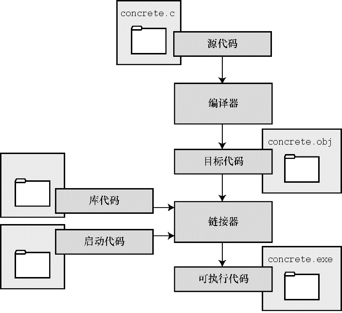
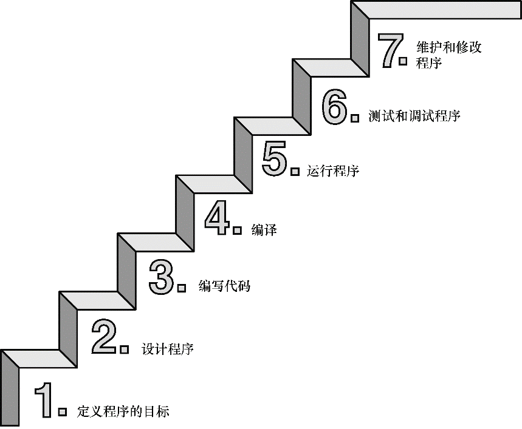

# C语言优点
- 效率高
- 控制能力强
- 程序可移植
- 通用性强,使用广泛
# 编译器
是把代码转换成计算机内部指令的程序
# 编程过程
编译器将源代码编译为目标代码,通过链接器将库代码和启动代码链接起来,从而成为机器可以直接读取的二进制代码(指令集)

本书包含一些强调特定知识点的特殊元素，提示、注意、警告，将以如下形式出现在本书中：边栏边栏提供更深入的讨论或额外的背景，有助于解释当前的主题。提示提示一般都短小精悍，帮助读者理解一些特殊的编程情况。警告用于警告读者注意一些潜在的陷阱。注意提供一些评论，提醒读者不要误入歧途。

