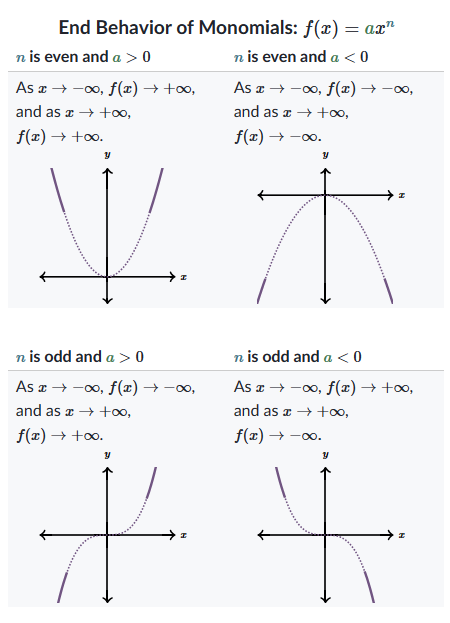

---
tags:
  - 多项式
---

多项式的端行为（end behavior）是指随着 $x$ 趋近于无穷大或负无穷大时，多项式函数 $f(x)$ 的行为。端行为主要由多项式的最高次项决定。以下是判断多项式端行为的步骤和原则：

### 步骤和原则：

1. **确定最高次项：**
   找出多项式中次数最高的项，即系数 $a_n$ 和变量 $x$ 的指数 $n$ 形成的项 $a_n x^n$。

2. **考虑最高次项的次数和系数：**
   - **次数 $n$ 的奇偶性：** 
     - 若 $n$ 是偶数，函数在两端的行为相同。
     - 若 $n$ 是奇数，函数在两端的行为相反。
   - **系数 $a_n$ 的正负性：**
     - 若 $a_n$ 是正数，函数在正无穷大时趋向正无穷大，在负无穷大时根据 $n$ 的奇偶性变化。
     - 若 $a_n$ 是负数，函数在正无穷大时趋向负无穷大，在负无穷大时根据 $n$ 的奇偶性变化。

### 具体分析：

1. **偶数次最高项（$n$ 为偶数）：**
   - 若 $a_n > 0$（正系数）：当 $x \to \infty$ 或 $x \to -\infty$，$f(x) \to \infty$。
   - 若 $a_n < 0$（负系数）：当 $x \to \infty$ 或 $x \to -\infty$，$f(x) \to -\infty$。

2. **奇数次最高项（$n$ 为奇数）：**
   - 若 $a_n > 0$（正系数）：当 $x \to \infty$，$f(x) \to \infty$；当 $x \to -\infty$，$f(x) \to -\infty$。
   - 若 $a_n < 0$（负系数）：当 $x \to \infty$，$f(x) \to -\infty$；当 $x \to -\infty$，$f(x) \to \infty$。

### 例子分析：

#### 例子 1：$h(x) = -2x^5 + 8x^4 - 2x^2 + 15$
- **最高次项**：$-2x^5$。
- **次数 $n$**：5（奇数）。
- **系数 $a_n$**：-2（负数）。
- **端行为**：
  - 当 $x \to \infty$，$h(x) \to -\infty$。
  - 当 $x \to -\infty$，$h(x) \to \infty$。

#### 例子 2：$f(x) = 3x^4 - 5x^3 + x - 7$
- **最高次项**：$3x^4$。
- **次数 $n$**：4（偶数）。
- **系数 $a_n$**：3（正数）。
- **端行为**：
  - 当 $x \to \infty$，$f(x) \to \infty$。
  - 当 $x \to -\infty$，$f(x) \to \infty$。

### 总结：

通过以上步骤，你可以通过分析多项式的最高次项来快速确定其端行为。关键在于最高次项的次数（奇数或偶数）和系数（正数或负数）的组合情况。理解这些原则后，可以准确地判断多项式在无穷远处的行为。

如果有更多问题或需要进一步解释的地方，请随时提问！
