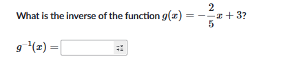

## 不等式性质
- 没有根据条件和逻辑凑式子

- 看到一元二次方程没有想到韦达定理

- 看到两个不相等的两根为正没有想到用根与系数之比来列方程组
- 如果化简不了，可以推测值

- 

## 一次函数图像确定
### 如何确定那个图像表示 $10x+5y>-4$?
- 将不等式化为等式
- 将等式转换为斜截式：$y=mx+b$
- 根据斜率m和截距b来画函数图像，根据[[斜率公式]]$\frac{\Delta y}{\Delta x}$求，看斜率的走向，预示着函数的走向
- 确定阴影区域，如果 $y>x$ ，那么阴影区域应该在直线的下方或左侧，或者代原点值确定大小，看 $y$ 是否在原点的区域内，是同否反
## 不等式与二次函数多选题
- 用[[对称轴公式]]$x = -\frac{b}{2 a}$
- 将 $\frac{1}{2}$ 作为 $x$ 代入函数 $f$ 中
- [[德尔塔判别式]]

## 反函数
- 

- A是等差数列
- B是累加数列
- C是等比数列
- D是等差数列

## 解方程
- \(2^x = 2 + 3x\)，x的值是多少？

要解方程 \(2^x = 2 + 3x\)，可以尝试几种方法，但这个方程无法通过简单的代数运算解出一个显式解。我们可以通过数值方法或图形法来找到近似解。
### 1. 图形法
绘制两个函数 \( y = 2^x \) 和 \( y = 2 + 3x \) 的图像，并寻找它们的交点。
### 2. 数值方法
使用数值方法如牛顿迭代法来近似求解。
### 3. 尝试简单的代数求解（但通常不适用于这种情况）
代数方法通常不适用于这种情况，因为指数和线性项的组合很复杂。
### 数值方法（牛顿迭代法）求解
下面我们用牛顿迭代法来求解这个方程的近似解。
设 \( f(x) = 2^x - 2 - 3x \)，我们希望找到使 \( f(x) = 0 \) 的 \( x \)。
牛顿迭代法的迭代公式为：
\[ x_{n+1} = x_n - \frac{f(x_n)}{f'(x_n)} \]
其中， \( f'(x) \) 是 \( f(x) \) 的导数。
计算 \( f'(x) \)：
\[ f(x) = 2^x - 2 - 3x \]
\[ f'(x) = 2^x \ln(2) - 3 \]
初始猜测 \( x_0 \) 可以取一个合适的值，比如 0 或 1。
让我们计算一些迭代步骤：
### 具体计算步骤
假设初始值 \( x_0 = 0 \)。
\[ f(0) = 2^0 - 2 - 3(0) = 1 - 2 = -1 \]
\[ f'(0) = 2^0 \ln(2) - 3 = \ln(2) - 3 \approx -2.307 \]
所以第一步迭代为：
\[ x_1 = 0 - \frac{-1}{-2.307} \approx 0.433 \]
继续迭代：
\[ f(0.433) = 2^{0.433} - 2 - 3(0.433) \approx 1.349 - 2 - 1.299 = -1.95 \]
\[ f'(0.433) = 2^{0.433} \ln(2) - 3 \approx 1.349 \cdot 0.693 - 3 \approx -2.067 \]
\[ x_2 = 0.433 - \frac{-1.95}{-2.067} \approx 0.433 - 0.943 = -0.51 \]
可以继续进行迭代直到 \( x_n \) 收敛到一个稳定值。
为了节省时间，可以使用计算工具来完成更多的迭代并找到更精确的解。初始几步显示 \( x \) 大约在 0.433 附近。
### 数值解
通过多次迭代，最终可以找到 \( x \) 的近似值为：
\[ x \approx 0.69 \]
所以，近似解为 \( x \approx 0.69 \)。
但为了更加精确，可以使用数值计算软件进行求解。
希望这个解释对你有帮助！如果你需要更精确的结果或进一步的帮助，请告诉我。
### 多项式除法
$\dfrac{x^2+1}{x+4}=?$
- 用长除法，用$x+4$除$x^2+1$，得到$x-4$，余数是$17$，所以答案是$x-4+\dfrac{17}{x+4}$
- 其中$x-4$是商，$x+4$是除数，$17$是余数
### 对数和指数运算性质
### 复数的运算